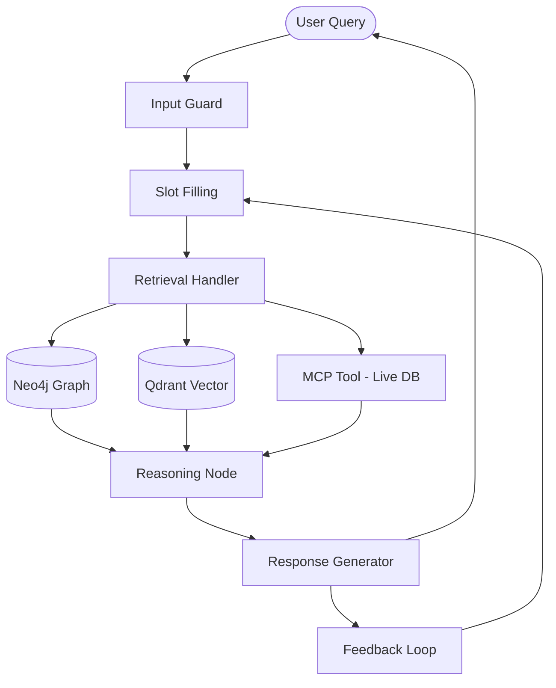

# Hybrid Retrieval-Augmented Generation (HRAG) for DevOps

A comprehensive DevOps Incident Response Copilot that leverages a **Hybrid RAG** architecture, combining **Knowledge Graph (Neo4j)** for structured relationship retrieval and **Vector Database (Qdrant)** for semantic search. Includes **MCP (Model Context Protocol)** for real-time diagnostic data.

## 🚀 Overview

This project implements a "Human-in-the-Loop" architecture for incident management. It assists DevOps engineers by:
- **Ingesting**: Multi-format logs and runbooks into a dual-store (Graph + Vector).
- **Extracting**: Entities and relationships using dynamic schemas.
- **Resolving**: Conflicts via a "Gardener" interface (Human-in-the-Loop).
- **Reasoning**: Multi-step LangGraph agent with real-time tool access (MCP).
- **Diagnosing**: Automated root cause analysis and resolution planning.

## 🧠 System Architecture



## 📂 Project Structure

```
├── hrag-backend/              # FastAPI + LangGraph Backend
│   ├── app/
│   │   ├── api/               # API Routes (Chat, Docs, Health)
│   │   ├── core/              # Config, Logging, Utils
│   │   ├── nodes/             # LangGraph Logic Nodes
│   │   ├── services/          # Ingestion, Auth, MCP, Gardener
│   │   ├── graph.py           # LangGraph Workflow Definition
│   │   └── schema_registry.py # Dynamic Domain Schema Management
│   ├── config/                # Domain YAML Configurations
│   └── scripts/               # Knowledge Base Seeding Scripts
│
├── hrag-frontend/             # Next.js 16 + Tailwind Frontend
│   ├── app/                   # Pages & App Router
│   ├── components/            # React Components (Copilot, Knowledge, UI)
│   ├── lib/                   # API Utilities
│   └── hooks/                 # Custom React Hooks
```

## 🚀 Getting Started

Please refer to the README files in each directory for specific setup instructions:

- [**Backend Setup**](./hrag-backend/README.md) - FastAPI, Neo4j, Qdrant instructions.
- [**Frontend Setup**](./hrag-frontend/README.md) - Next.js development server instructions.

> [!IMPORTANT]
> Ensure you configure your environment variables in both directories based on the `.env.example` files provided.
